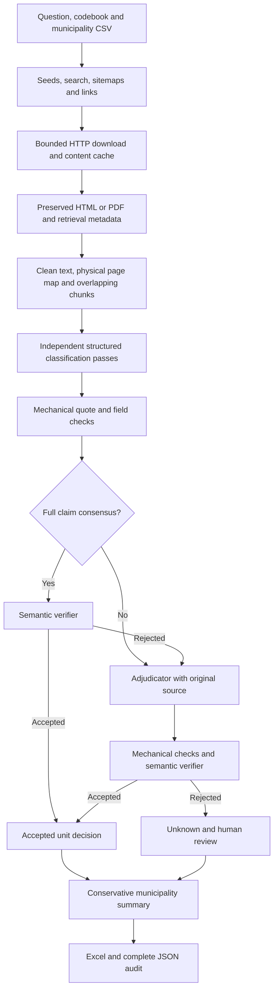

# Architecture and evidence contract

| Module | Responsibility |
| --- | --- |
| config | Validate configuration, codebook and CSV input |
| network | Host restrictions, robots, pacing, retries, body bounds and HTTP cache |
| discovery | Candidate provenance, domain-limited search, sitemap traversal and link queue |
| extraction | Preserve source, normalize text, page spans and lossless chunk coordinates |
| models | Pydantic structured output and durable evidence models |
| llm | Responses API, request identity, API budget, response cache and replay |
| verification | Literal quotations, occurrence locations and required supporting fields |
| classification | Independent passes, consensus, semantic verification and adjudication |
| pipeline | Run manifests, checkpoints, summaries and failure reporting |
| export | Excel output with source strings forced to literal text |
| demo | Synthetic sources and mocked API transport, explicitly labeled |

The program treats source text, search responses and model outputs as untrusted data.
A model can select a quote, but cannot supply trusted coordinates: Python calculates
coordinates independently in the saved text. A quote copied from a different document
or an unseen part of the source cannot pass the chunk-local check.

Mechanical checks establish quote presence, schema validity, quote-index validity,
date syntax, and necessary citation roles. They **do not establish that a quotation
entails a claim**. The semantic verifier assesses attribution, chronology and meaning;
humans must inspect uncertain cases and a validation sample before research use.

Municipality summaries have no arbitrary positive-over-negative precedence. Distinct
conclusive labels or inconsistent explicit details trigger review. A row with category
Yes and `needs_review=true` contains some accepted positive evidence plus an unresolved
coverage or processing issue; it is not a fully validated municipality conclusion.

All source paths in results are relative to their run. Source IDs combine municipality,
final URL and raw content hash. Chunk IDs encode source ID and character boundaries.
LLM cache IDs include prompt version, role/pass, model, request settings, complete
prompt and JSON schema. Cache hits preserve the original response, not a new sample.

The implementation runs sequentially. Pacing and the invocation budget apply to one
process. Use separate run/cache directories or add explicit interprocess coordination
before adding parallel workers. Independent classification means separate inputs and
responses; it does not require concurrent execution.
